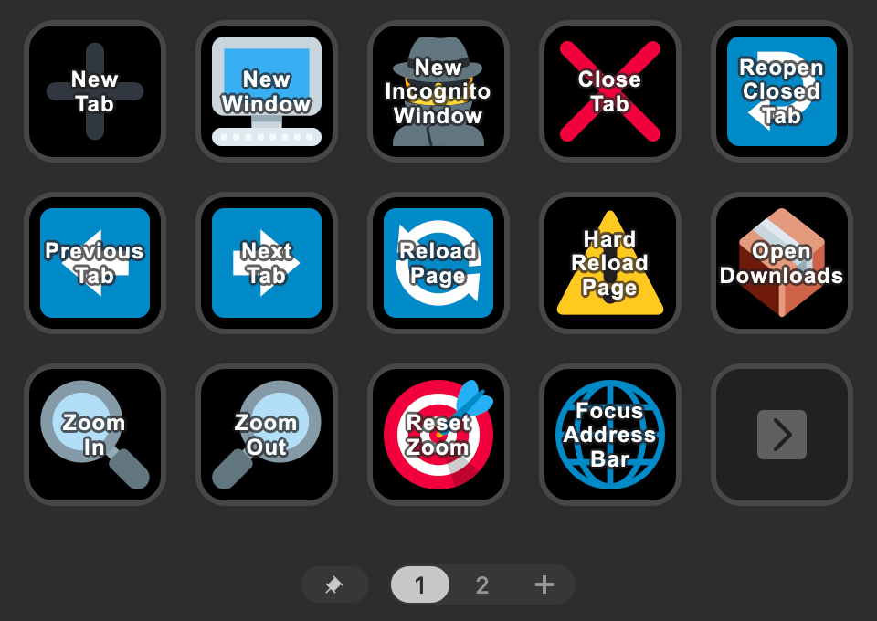

# Stream Deck Profile Generator

Generate custom Stream Deck profiles for any application by importing a CSV of hotkeys / keyboard shortcuts.

## Usage

Create a CSV file with the following columns:

- `Hotkey`: The keyboard shortcut (e.g. `Ctrl C`)
- `Label`: The label to display on the button (e.g. `Copy`)
- `Page`: The name of the page to place the button on (e.g. `Page One`) _(optional)_
- `Id`: A unique identifier for the button (e.g. `copy`) _(optional)_
- `Color`: The button color (e.g. `red` or `#FF0000`) _(optional)_

If any of these optional columns are omitted, sensible defaults will be used:

- `Page`: Pages will be created as needed to fit all buttons (including space for navigation buttons)
- `Id`: A unique ID will be generated based on the label
- `Color`: Default button color will be used

Run the generator with your CSV file:

```shell
stream-deck-profile-generator --input hotkeys.csv
```

Or specify any of the available options:

```shell
stream-deck-profile-generator \
  --input hotkeys.csv \
  --output MyProfile.streamDeckProfile \
  --profile-name "My Custom Profile" \
  --app-path '/Applications/YourApp.app' \
  --device mk \
  --button-style basic \
  --label-style both \
  --label-position middle \
  --bg-color black \
  --text-color white \
  --font-size 14 \
  --icons-dir ~/path/to/icons
```

## CLI Options

| Option                        | Description                                                                               | Default                              |
| ----------------------------- | ----------------------------------------------------------------------------------------- | ------------------------------------ |
| `--input <path>`              | Path to the input CSV file                                                                | _(required)_                         |
| `--output <path>`             | Path to the output `.streamDeckProfile` file                                              | `<input-filename>.streamDeckProfile` |
| `--profile-name <name>`       | Name of the profile                                                                       | `<input-filename>`                   |
| `--app-path <path>`           | Path to the application to switch to for this profile                                     | _(optional)_                         |
| `--device <type>`             | Stream Deck model (e.g. `mk`, `xl`, `mini`)                                               | `mk`                                 |
| `--button-style <style>`      | Button style (e.g. `basic`, `border`, `rainbow`, `fill`)                                  | `basic`                              |
| `--label-style <style>`       | Label style (e.g. `label`, `hotkey`, `both`, `none`)                                      | `both`                               |
| `--label-position <position>` | Label vertical position (e.g. `top`, `middle`, `bottom`)                                  | `middle`                             |
| `--bg-color <color>`          | Default button background color (e.g. `red`, `#FF0000`)                                   | `black`                              |
| `--text-color <color>`        | Default button text color (e.g. `white`, `#FFFFFF`)                                       | `white`                              |
| `--font-size <size>`          | Default button font size                                                                  | `14`                                 |
| `--icons-dir <path>`          | Path to a directory containing SVG, PNG, JPG, GIF or WEBP icons. Matches on the hotkey id | _(optional)_                         |

## Button Styles

Button styles are defined in [button-styles/](button-styles/):

| Preview                               | Style     | Description                                                     |
| ------------------------------------- | --------- | --------------------------------------------------------------- |
|      | `basic`   | Button with a dark gradient background color                    |
|    | `border`  | Button with a border around the label                           |
|  | `rainbow` | Button with a rainbow border                                    |
|      | `fill`    | Button with a filled background color (defined by `--bg-color`) |

## Examples

Some example profiles are available in the [examples/](examples/) directory.

### Chrome Hotkeys (macOS)

- Input: [chrome-hotkeys-macos.csv](examples/chrome-hotkeys-macos.csv)
- Profile: [chrome-hotkeys-macos.streamDeckProfile](examples/chrome-hotkeys-macos.streamDeckProfile)

#### Basic Button Style


```shell
stream-deck-profile-generator --input examples/chrome-hotkeys-macos.csv --profile-name "Chrome Hotkeys (macOS)" --app-path "/Applications/Google Chrome.app"
```

#### Border Button Style


```shell
stream-deck-profile-generator --input examples/chrome-hotkeys-macos.csv --button-style border
```

#### Rainbow Button Style


```shell
stream-deck-profile-generator --input examples/chrome-hotkeys-macos.csv --button-style rainbow
```

#### Fill Button Style (Custom Colors)


```shell
stream-deck-profile-generator --input examples/chrome-hotkeys-macos.csv --bg-color purple --text-color yellow
```

### Chrome Hotkeys (Windows) with Icons

- Input: [chrome-hotkeys-windows.csv](examples/chrome-hotkeys-windows.csv)
- Profile: [chrome-hotkeys-windows.streamDeckProfile](examples/chrome-hotkeys-windows.streamDeckProfile)

This includes an `Id` column to match against icon filenames in the `--icon-path` directory.

This example uses [Twemoji](https://github.com/twitter/twemoji) SVG icons from [boywithkeyboard-archive/twemoji_svg](https://github.com/boywithkeyboard-archive/twemoji_svg):



```shell
stream-deck-profile-generator --input examples/chrome-hotkeys-windows.csv --icons-dir ~/path/to/twemoji_svg/files --label-style label
```

### Navigation Buttons

- Input: [macos-hotkeys.csv](examples/macos-hotkeys.csv)
- Profile: [macos-hotkeys.streamDeckProfile](examples/macos-hotkeys.streamDeckProfile)

If there are more than 2 pages, Previous/Next navigation buttons will be automatically added to each page in the bottom right corner. This example also demonstrates using a `Page` column to group buttons onto different pages:


```shell
stream-deck-profile-generator --input examples/macos-hotkeys.csv
```

### Customising Individual Buttons

- Input: [rainbow-virtual-keyboard.csv](examples/rainbow-virtual-keyboard.csv)
- Profile: [rainbow-virtual-keyboard.streamDeckProfile](examples/rainbow-virtual-keyboard.streamDeckProfile)

This includes a `Color` column to customise individual button colors:


```shell
stream-deck-profile-generator --input examples/rainbow-virtual-keyboard.csv --font-size 24 --label-style label
```

## Development

To install dependencies:

```shell
bun install
```

To run:

```shell
bun run generate --input path/to/hotkeys.csv --output MyProfile.streamDeckProfile
```

To test:

```shell
bun test
```

To regenerate example profiles:

```shell
bun run generate:examples
```

To generate button style images:

```shell
bun run generate:button-styles
```
